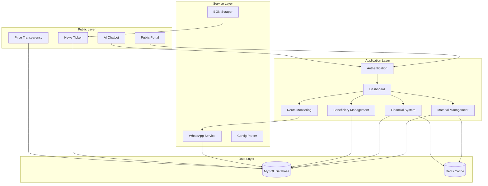
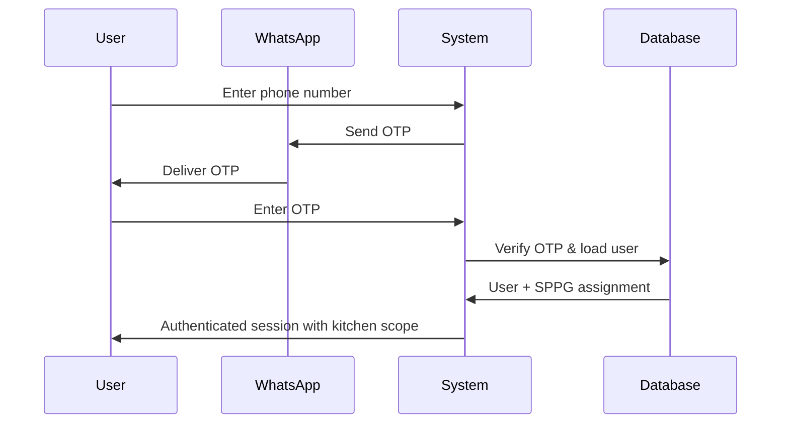
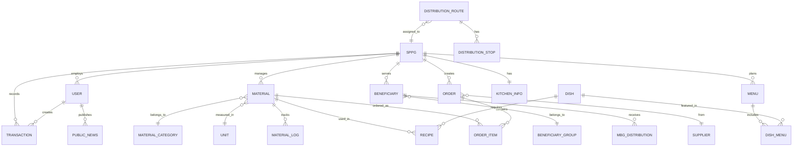

# Design Document: MBG System Comprehensive Revision

## Overview

This design document specifies the technical implementation for a comprehensive revision of the MBG (Makanan Bergizi Gratis) Admin & Financial System. The system is a Laravel-based web application that manages kitchen operations, beneficiary tracking, financial transactions, material inventory, and public transparency for a government nutrition program.

The revision introduces multi-kitchen support with kitchen-scoped data isolation, enhanced role management, improved financial tracking aligned with government reporting standards, WhatsApp-based route monitoring, and public engagement features including a news portal and price transparency system.

### System Context

- **Framework**: Laravel 10.x with Blade templating
- **Database**: MySQL 8.0
- **Frontend**: Vite for asset bundling, Tailwind CSS for styling
- **External Integrations**: WhatsApp API (Kirimi.id), BGN website scraping, Siperda market price system
- **Deployment**: Traditional LAMP stack with scheduled tasks via Laravel Scheduler

### Key Design Goals

1. **Multi-tenancy**: Implement kitchen-based data isolation without requiring separate databases
2. **Financial Compliance**: Align transaction tracking with BGN government reporting formats (LP2DM, SPTJ, BAPAD)
3. **Operational Efficiency**: Streamline material management, purchase orders, and inventory tracking
4. **Public Transparency**: Provide public access to program information, pricing, and engagement channels
5. **Mobile-First Monitoring**: Enable route tracking via WhatsApp messages without requiring driver app installation

## Architecture

### High-Level Architecture



### Multi-Kitchen Architecture Pattern

The system implements a soft multi-tenancy pattern where:
- Each kitchen (SPPG) operates as an independent tenant
- All data is stored in a single database with `sppg_id` foreign keys
- Application-level filtering ensures data isolation
- Global middleware applies kitchen scope to all queries
- Shared resources (dishes, units) are accessible across kitchens

### Authentication & Authorization Flow



## Components and Interfaces

### 1. Database Schema Changes

#### New Tables

**units** - Measurement unit management
```sql
CREATE TABLE units (
    id BIGINT UNSIGNED AUTO_INCREMENT PRIMARY KEY,
    name VARCHAR(50) NOT NULL UNIQUE,
    abbreviation VARCHAR(10),
    created_at TIMESTAMP NULL,
    updated_at TIMESTAMP NULL
);
```

**material_categories** - Material classification
```sql
CREATE TABLE material_categories (
    id BIGINT UNSIGNED AUTO_INCREMENT PRIMARY KEY,
    name ENUM('Karbohidrat', 'Protein_Hewani', 'Protein_Nabati', 'Buah', 'Tambahan') NOT NULL UNIQUE,
    description TEXT NULL,
    created_at TIMESTAMP NULL,
    updated_at TIMESTAMP NULL
);
```

**transactions** - Unified financial transaction system
```sql
CREATE TABLE transactions (
    id BIGINT UNSIGNED AUTO_INCREMENT PRIMARY KEY,
    sppg_id BIGINT UNSIGNED NOT NULL,
    date DATE NOT NULL,
    description TEXT NOT NULL,
    transaction_type ENUM('Biaya_Bahan_Baku', 'Biaya_Operasional', 'Insentif_Fasilitas', 'Bantuan_Pemerintah') NOT NULL,
    amount DECIMAL(15,2) NOT NULL,
    cash_type ENUM('Virtual_Account', 'Kas_Kecil') NOT NULL,
    proof_path VARCHAR(255) NULL,
    created_by BIGINT UNSIGNED NOT NULL,
    created_at TIMESTAMP NULL,
    updated_at TIMESTAMP NULL,
    FOREIGN KEY (sppg_id) REFERENCES sppgs(id) ON DELETE CASCADE,
    FOREIGN KEY (created_by) REFERENCES users(id),
    INDEX idx_sppg_date (sppg_id, date),
    INDEX idx_transaction_type (transaction_type)
);
```

**public_news** - Public portal content
```sql
CREATE TABLE public_news (
    id BIGINT UNSIGNED AUTO_INCREMENT PRIMARY KEY,
    title VARCHAR(255) NOT NULL,
    content TEXT NOT NULL,
    image_path VARCHAR(255) NULL,
    published_at TIMESTAMP NULL,
    created_by BIGINT UNSIGNED NOT NULL,
    created_at TIMESTAMP NULL,
    updated_at TIMESTAMP NULL,
    FOREIGN KEY (created_by) REFERENCES users(id)
);
```

**public_aspirations** - Public feedback and price observations
```sql
CREATE TABLE public_aspirations (
    id BIGINT UNSIGNED AUTO_INCREMENT PRIMARY KEY,
    name VARCHAR(255) NOT NULL,
    phone VARCHAR(20) NOT NULL,
    location VARCHAR(255) NOT NULL,
    message TEXT NOT NULL,
    created_at TIMESTAMP NULL,
    updated_at TIMESTAMP NULL,
    INDEX idx_created_at (created_at)
);
```

**bgn_content** - Scraped content from BGN website
```sql
CREATE TABLE bgn_content (
    id BIGINT UNSIGNED AUTO_INCREMENT PRIMARY KEY,
    title VARCHAR(255) NOT NULL,
    content TEXT NOT NULL,
    source_url VARCHAR(500) NOT NULL,
    fetched_at TIMESTAMP NOT NULL,
    created_at TIMESTAMP NULL,
    updated_at TIMESTAMP NULL
);
```

**kitchen_info** - Public kitchen information
```sql
CREATE TABLE kitchen_info (
    id BIGINT UNSIGNED AUTO_INCREMENT PRIMARY KEY,
    sppg_id BIGINT UNSIGNED NOT NULL UNIQUE,
    building_photo_path VARCHAR(255) NULL,
    kitchen_photo_path VARCHAR(255) NULL,
    management_profile TEXT NULL,
    contact_phone VARCHAR(20) NULL,
    contact_address TEXT NULL,
    created_at TIMESTAMP NULL,
    updated_at TIMESTAMP NULL,
    FOREIGN KEY (sppg_id) REFERENCES sppgs(id) ON DELETE CASCADE
);
```

#### Modified Tables

**materials** - Add category, expiration, and enhanced tracking
```sql
ALTER TABLE materials 
ADD COLUMN category_id BIGINT UNSIGNED NULL AFTER type,
ADD COLUMN unit_id BIGINT UNSIGNED NULL AFTER category_id,
ADD COLUMN expiration_date DATE NULL AFTER stock,
ADD COLUMN notes TEXT NULL AFTER expiration_date,
ADD COLUMN last_purchase_price DECIMAL(15,2) NULL AFTER price,
ADD COLUMN estimated_needs DECIMAL(15,2) DEFAULT 0 AFTER last_purchase_price,
ADD FOREIGN KEY (category_id) REFERENCES material_categories(id),
ADD FOREIGN KEY (unit_id) REFERENCES units(id),
ADD INDEX idx_expiration (expiration_date),
ADD INDEX idx_category (category_id);
```

**users** - Add job position field
```sql
ALTER TABLE users
ADD COLUMN job_position ENUM('Quality_Control', 'Pengawas_Gizi', 'Admin', 'Driver', 'Volunteer') NULL AFTER role;
```

**sppgs** - Add kitchen identifier and capacity constraints
```sql
ALTER TABLE sppgs
ADD COLUMN kitchen_identifier VARCHAR(50) UNIQUE NOT NULL AFTER name,
ADD COLUMN max_users INT DEFAULT 999 AFTER location,
ADD COLUMN description TEXT NULL AFTER max_users;
```

**beneficiaries** - Add type and portion estimates
```sql
ALTER TABLE beneficiaries
ADD COLUMN beneficiary_type ENUM('Sekolah', 'Posyandu') NOT NULL DEFAULT 'Sekolah' AFTER sppg_id,
ADD COLUMN porsi_besar INT DEFAULT 0 AFTER category,
ADD COLUMN porsi_kecil INT DEFAULT 0 AFTER porsi_besar;
```

**distribution_routes** - Add driver phone for WhatsApp integration
```sql
ALTER TABLE distribution_routes
ADD COLUMN driver_phone VARCHAR(20) NULL AFTER sppg_id,
ADD COLUMN status ENUM('pending', 'in_progress', 'completed') DEFAULT 'pending' AFTER driver_phone,
ADD COLUMN departed_at TIMESTAMP NULL AFTER status,
ADD INDEX idx_driver_phone (driver_phone);
```

**distribution_stops** - Add arrival tracking
```sql
ALTER TABLE distribution_stops
ADD COLUMN arrived_at TIMESTAMP NULL AFTER quantity,
ADD COLUMN notes TEXT NULL AFTER arrived_at;
```

**orders** - Enhance purchase order tracking
```sql
ALTER TABLE orders
ADD COLUMN order_number VARCHAR(50) UNIQUE NULL AFTER id,
ADD COLUMN status ENUM('draft', 'sent', 'received', 'cancelled') DEFAULT 'draft' AFTER supplier_id,
ADD COLUMN printed_at TIMESTAMP NULL AFTER status;
```

### 2. Model Relationships

#### Core Models

**User Model** (`app/Models/User.php`)
```php
class User extends Authenticatable
{
    // Relationships
    public function sppg(): BelongsTo
    public function createdTransactions(): HasMany
    public function createdNews(): HasMany
    
    // Scopes
    public function scopeForKitchen($query, $sppgId)
    public function scopeByRole($query, $role)
    public function scopeByJobPosition($query, $position)
    
    // Authorization
    public function isAdmin(): bool
    public function canManageFinance(): bool
    public function canManageWarehouse(): bool
    public function canMonitorRoutes(): bool
}
```

**Material Model** (`app/Models/Material.php`)
```php
class Material extends Model
{
    // Relationships
    public function sppg(): BelongsTo
    public function category(): BelongsTo
    public function unit(): BelongsTo
    public function logs(): HasMany
    public function recipes(): HasMany
    
    // Accessors
    public function getIsExpiringSoonAttribute(): bool
    public function getDaysUntilExpirationAttribute(): int
    
    // Methods
    public function subtract(float $quantity): bool
    public function updateLastPurchasePrice(float $price): void
}
```

**Transaction Model** (`app/Models/Transaction.php`)
```php
class Transaction extends Model
{
    // Relationships
    public function sppg(): BelongsTo
    public function creator(): BelongsTo
    
    // Scopes
    public function scopeForKitchen($query, $sppgId)
    public function scopeByType($query, $type)
    public function scopeByDateRange($query, $start, $end)
    public function scopeIncome($query)
    public function scopeExpense($query)
    
    // Accessors
    public function getIsIncomeAttribute(): bool
    public function getIsExpenseAttribute(): bool
    public function getMasukAttribute(): float
    public function getKeluarAttribute(): float
}
```

**Beneficiary Model** (`app/Models/Beneficiary.php`)
```php
class Beneficiary extends Model
{
    // Relationships
    public function sppg(): BelongsTo
    public function group(): BelongsTo
    public function distributions(): HasMany
    
    // Scopes
    public function scopeForKitchen($query, $sppgId)
    public function scopeByType($query, $type)
    public function scopeByCategory($query, $category)
    
    // Accessors
    public function getTotalPortionsAttribute(): int
    public function getKitchenNameAttribute(): string
}
```

**DistributionRoute Model** (`app/Models/DistributionRoute.php`)
```php
class DistributionRoute extends Model
{
    // Relationships
    public function sppg(): BelongsTo
    public function stops(): HasMany
    
    // Scopes
    public function scopeForKitchen($query, $sppgId)
    public function scopeByDriverPhone($query, $phone)
    public function scopeActive($query)
    
    // Methods
    public function recordDeparture(): void
    public function recordArrival(DistributionStop $stop): void
    public function getProgress(): array
}
```

### 3. Controllers

#### MaterialController Enhancements
```php
class MaterialController extends Controller
{
    public function index(Request $request)
    {
        // Filter by kitchen scope
        // Support category filtering
        // Show expiration warnings
    }
    
    public function store(Request $request)
    {
        // Auto-fill unit from material defaults
        // Validate category selection
        // Set kitchen scope
    }
    
    public function subtract(Request $request, Material $material)
    {
        // Validate quantity against stock
        // Create material log entry
        // Update stock level
    }
    
    public function warehouseReport()
    {
        // Generate printable warehouse report
        // Include all required fields
    }
}
```

#### TransactionController (New)
```php
class TransactionController extends Controller
{
    public function index(Request $request)
    {
        // Display transaction list with balance calculation
        // Filter by date range, type, cash type
        // Show initial balance reminder if needed
    }
    
    public function create()
    {
        // Show transaction input form
        // Support file upload for proof
    }
    
    public function store(Request $request)
    {
        // Validate transaction data
        // Calculate balance difference
        // Store proof document
    }
    
    public function dashboard()
    {
        // Renamed from "Rekap Harian"
        // Show financial summary
    }
}
```

#### BeneficiaryController Enhancements
```php
class BeneficiaryController extends Controller
{
    public function index(Request $request)
    {
        // Filter by kitchen, type, category
        // Show kitchen name in list
    }
    
    public function create()
    {
        // Form with type selection (Sekolah/Posyandu)
        // Category selection with custom option
        // Portion estimates (Porsi_Besar/Porsi_Kecil)
    }
    
    public function store(Request $request)
    {
        // Validate beneficiary type
        // Set kitchen scope
        // Display in list below form
    }
}
```

#### RouteMonitoringController (New)
```php
class RouteMonitoringController extends Controller
{
    public function index()
    {
        // ASLAP dashboard showing active routes
        // Display departure and arrival times
    }
    
    public function configure(Request $request)
    {
        // Configure route with stops
        // Assign driver phone number
    }
    
    public function handleWhatsAppMessage(Request $request)
    {
        // Parse incoming WhatsApp message
        // Match to driver phone number
        // Record departure ("berangkat") or arrival ("tiba")
    }
}
```

#### PublicPortalController (New)
```php
class PublicPortalController extends Controller
{
    public function index()
    {
        // Display public homepage
        // Show news ticker
        // Display online user count
        // Show BGN content
    }
    
    public function kitchens()
    {
        // List all kitchens
    }
    
    public function kitchenDetail(Sppg $sppg)
    {
        // Show kitchen photos and info
        // Display management profile
        // Show contact information
    }
    
    public function submitAspiration(Request $request)
    {
        // Store public aspiration
        // Display in news ticker
    }
}
```

#### OrderController Enhancements
```php
class OrderController extends Controller
{
    public function create()
    {
        // Auto-fill price from last purchase
        // Auto-fill unit from material default
        // Allow price override
    }
    
    public function print(Order $order)
    {
        // Generate formatted purchase order
        // Follow government document standards
        // Record print timestamp
    }
}
```

### 4. Services

#### WhatsAppService Enhancements
```php
class WhatsAppService
{
    public function parseIncomingMessage(string $from, string $message): ?array
    {
        // Parse message content
        // Detect keywords: "berangkat", "tiba"
        // Return structured data
    }
    
    public function isRegisteredDriver(string $phone): bool
    {
        // Check if phone belongs to a driver
    }
    
    public function getActiveRouteForDriver(string $phone): ?DistributionRoute
    {
        // Find active route for driver
    }
}
```

#### BgnScraperService (New)
```php
class BgnScraperService
{
    public function fetchContent(): array
    {
        // Scrape bgn.go.id/juknis
        // Parse HTML content
        // Extract articles
        // Return structured data
    }
    
    public function storeContent(array $content): void
    {
        // Store in bgn_content table
        // Update existing records
    }
}
```

#### ConfigParserService (New)
```php
class ConfigParserService
{
    public function parse(string $configFile): ConfigurationObject
    {
        // Parse configuration file
        // Validate against schema
        // Return structured object
        // Throw exception on invalid format
    }
    
    public function prettyPrint(ConfigurationObject $config): string
    {
        // Format configuration object
        // Apply consistent indentation
        // Return formatted string
    }
}
```

#### FinancialReportService (New)
```php
class FinancialReportService
{
    public function generateLP2DM(int $sppgId, string $startDate, string $endDate): string
    {
        // Generate LP2DM report following BGN format
        // Include all required fields
        // Return formatted document
    }
    
    public function generateSPTJ(int $sppgId, string $startDate, string $endDate): string
    {
        // Generate SPTJ document following BGN format
    }
    
    public function generateBAPAD(int $sppgId, string $startDate, string $endDate): string
    {
        // Generate BAPAD document following BGN format
    }
    
    public function validateCompleteness(array $data): bool
    {
        // Validate document completeness
        // Check all required fields
    }
}
```

### 5. Middleware

#### KitchenScopeMiddleware (New)
```php
class KitchenScopeMiddleware
{
    public function handle(Request $request, Closure $next)
    {
        // Get authenticated user's SPPG
        // Apply global scope to Eloquent queries
        // Ensure data isolation
    }
}
```

### 6. View Components

#### Navigation Menu Updates
- Rename "Rekap Harian" → "Dashboard"
- Rename "Pembayaran" → "Input Transaksi"
- Rename "Manajemen Sekolah" → "Manajemen Penerima Manfaat"
- Remove duplicate "Daftar Pemasok"
- Update all logos to Delphi branding

#### Material Management Views
- Add category dropdown with 5 options
- Add unit dropdown with add-new capability
- Add expiration date field with warning indicator
- Add subtract operation button
- Change button text to "Tambahkan Bahan Baku"

#### Transaction Input View (New)
- Date picker
- Description textarea
- Transaction type dropdown (4 options)
- Amount input
- Cash type radio buttons (Virtual_Account/Kas_Kecil)
- Proof upload field
- Display columns: Date, Description, Masuk, Keluar, Selisih
- Show initial balance reminder when empty

#### Beneficiary Management View
- Type selection (Sekolah/Posyandu)
- Category dropdown with custom option
- Portion estimate fields (Porsi_Besar/Porsi_Kecil)
- Kitchen name display column
- Inline add form with list below

#### Public Portal Views
- Homepage with news ticker
- Kitchen listing page
- Kitchen detail page with photos
- Aspiration submission form
- Price transparency section with Siperda link
- BGN content display section
- Live chat interface

## Data Models

### Entity Relationship Diagram



### Key Data Constraints

1. **Kitchen Isolation**: All operational data (materials, orders, menus, beneficiaries, transactions) must have `sppg_id` foreign key
2. **User Capacity**: SPPG "Karang Rejo" limited to 1 user, others default to 999
3. **Material Categories**: Exactly 5 categories (Karbohidrat, Protein_Hewani, Protein_Nabati, Buah, Tambahan)
4. **Transaction Types**: 4 types (3 expense, 1 income)
5. **Cash Types**: 2 types (Virtual_Account, Kas_Kecil)
6. **Beneficiary Types**: 2 types (Sekolah, Posyandu)
7. **Route Status**: 3 states (pending, in_progress, completed)

### Data Validation Rules

**Material Creation**:
- `name`: required, string, max 255
- `category_id`: required, exists in material_categories
- `unit_id`: required, exists in units
- `expiration_date`: required, date, after today
- `sppg_id`: auto-filled from authenticated user

**Transaction Creation**:
- `date`: required, date
- `description`: required, string
- `transaction_type`: required, enum
- `amount`: required, numeric, min 0
- `cash_type`: required, enum
- `proof_path`: nullable, file, mimes:pdf,jpg,png, max:5MB

**Beneficiary Creation**:
- `name`: required, string, max 255
- `beneficiary_type`: required, enum
- `category`: required, string
- `porsi_besar`: required, integer, min 0
- `porsi_kecil`: required, integer, min 0
- `sppg_id`: auto-filled from authenticated user

**Order Creation**:
- `supplier_id`: required, exists, same kitchen
- `items`: required, array, min 1
- `items.*.material_id`: required, exists, same kitchen
- `items.*.quantity`: required, numeric, min 0
- `items.*.price`: required, numeric, min 0 (can override auto-fill)

## Error Handling

### Application-Level Error Handling

**Kitchen Scope Violations**:
- Detect attempts to access data from other kitchens
- Return 403 Forbidden with message "Akses ditolak: Data milik dapur lain"
- Log security event for audit

**Stock Deduction Errors**:
- Validate quantity before deduction
- If insufficient stock, return validation error: "Stok tidak mencukupi. Tersedia: {available}, Diminta: {requested}"
- Rollback transaction on failure

**WhatsApp Message Parsing Errors**:
- Ignore messages from unregistered numbers (silent fail)
- Log parsing failures for debugging
- Continue processing other messages

**BGN Scraper Failures**:
- Catch HTTP exceptions
- Display last successfully fetched content
- Log failure with timestamp
- Retry on next scheduled run

**File Upload Errors**:
- Validate file type and size before processing
- Return user-friendly error messages
- Clean up partial uploads on failure

### Database Error Handling

**Foreign Key Violations**:
- Catch constraint violations
- Return user-friendly message: "Operasi gagal: Data terkait dengan record lain"
- Suggest cascade delete where appropriate

**Duplicate Entry Errors**:
- Detect unique constraint violations
- Return specific field error: "{field} sudah digunakan"
- Suggest alternative values

**Connection Failures**:
- Implement retry logic with exponential backoff
- Display maintenance message to users
- Alert administrators via log

### Validation Error Handling

**Form Validation**:
- Return all validation errors at once
- Display errors next to relevant fields
- Preserve user input on validation failure
- Highlight invalid fields with red border

**Business Rule Violations**:
- User capacity exceeded: "Dapur {name} sudah mencapai batas maksimal pengguna ({max})"
- Expiration date in past: "Tanggal kadaluarsa harus di masa depan"
- Invalid transaction type: "Jenis transaksi tidak valid"

## Testing Strategy

This feature involves extensive CRUD operations, infrastructure configuration, UI rendering, and external service integration. Property-based testing is NOT appropriate for this comprehensive system revision. Instead, we will use:

### Unit Testing Approach

**Model Tests**:
- Test model relationships (belongsTo, hasMany)
- Test accessors and mutators
- Test scope methods
- Test business logic methods (e.g., `Material::subtract()`)

**Service Tests**:
- Test WhatsAppService message parsing with various input formats
- Test BgnScraperService HTML parsing with mock responses
- Test ConfigParserService with valid and invalid config files
- Test FinancialReportService document generation

**Validation Tests**:
- Test form request validation rules
- Test business rule enforcement
- Test error message generation

### Integration Testing Approach

**Controller Tests**:
- Test kitchen scope filtering
- Test CRUD operations with database
- Test file upload handling
- Test authentication and authorization

**Feature Tests**:
- Test complete user workflows (e.g., create material → add to order → receive order → subtract stock)
- Test multi-kitchen data isolation
- Test WhatsApp webhook integration
- Test public portal access without authentication

### Manual Testing Requirements

**UI/UX Testing**:
- Verify all menu renames are applied
- Verify Delphi logo appears in all locations
- Verify Indonesian button labels
- Verify responsive design on mobile devices
- Verify print layouts for purchase orders and financial reports

**External Integration Testing**:
- Test WhatsApp message delivery and receipt
- Test BGN website scraping with live site
- Test Siperda link functionality
- Test file uploads to storage

### Test Data Setup

**Seeders Required**:
- Material categories (5 predefined)
- Units (common measurements)
- SPPGs (multiple kitchens including Karang Rejo)
- Users (various roles and job positions)
- Sample materials, beneficiaries, transactions

**Factory Definitions**:
- UserFactory with kitchen assignment
- MaterialFactory with category and expiration
- TransactionFactory with type and cash type
- BeneficiaryFactory with type and portions
- OrderFactory with items

### Testing Configuration

**PHPUnit Configuration**:
```xml
<testsuites>
    <testsuite name="Unit">
        <directory suffix="Test.php">./tests/Unit</directory>
    </testsuite>
    <testsuite name="Feature">
        <directory suffix="Test.php">./tests/Feature</directory>
    </testsuite>
</testsuites>
```

**Test Database**:
- Use SQLite in-memory database for speed
- Run migrations before each test
- Seed required reference data
- Use database transactions for test isolation

### Coverage Goals

- Unit tests: 80% code coverage for services and models
- Feature tests: Cover all critical user workflows
- Integration tests: Cover all external service integrations
- Manual tests: Cover all UI changes and print layouts

---

## Implementation Notes

### Migration Execution Order

1. Create new tables (units, material_categories, transactions, public_news, public_aspirations, bgn_content, kitchen_info)
2. Modify existing tables (materials, users, sppgs, beneficiaries, distribution_routes, distribution_stops, orders)
3. Seed reference data (categories, units)
4. Migrate existing payment data to transactions table
5. Update foreign key constraints

### Deployment Considerations

**Database Backup**: Full backup required before migration
**Downtime Window**: Estimated 30 minutes for migration execution
**Rollback Plan**: Keep migration down() methods functional
**Data Migration**: Script to convert payments → transactions with proper type mapping

### Performance Optimization

**Indexing Strategy**:
- Add composite index on (sppg_id, date) for transactions
- Add index on expiration_date for materials
- Add index on driver_phone for distribution_routes
- Add index on created_at for public_aspirations

**Caching Strategy**:
- Cache BGN content for 24 hours
- Cache kitchen list for public portal
- Cache material categories and units
- Use Redis for session storage

**Query Optimization**:
- Eager load relationships to avoid N+1 queries
- Use pagination for large lists
- Implement database query logging in development
- Add query result caching for reports

### Security Considerations

**Kitchen Data Isolation**:
- Global scope middleware on all authenticated routes
- Explicit sppg_id checks in policy classes
- Audit log for cross-kitchen access attempts

**File Upload Security**:
- Validate MIME types server-side
- Store files outside public directory
- Generate unique filenames to prevent overwriting
- Scan uploads for malware (if available)

**WhatsApp Webhook Security**:
- Validate webhook signatures
- Rate limit incoming messages
- Sanitize message content before processing

**Public Portal Security**:
- Rate limit aspiration submissions
- Sanitize user input before display in news ticker
- Implement CAPTCHA on public forms
- Prevent SQL injection in search queries

This design provides a comprehensive technical specification for implementing all 24 requirements while maintaining system integrity, performance, and security.

